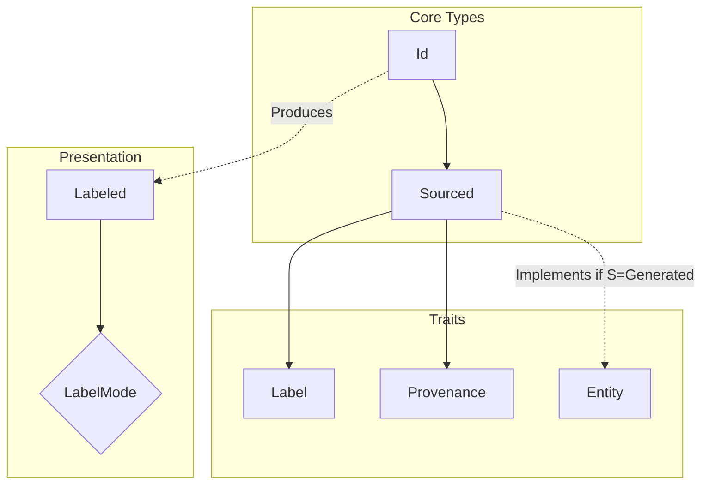
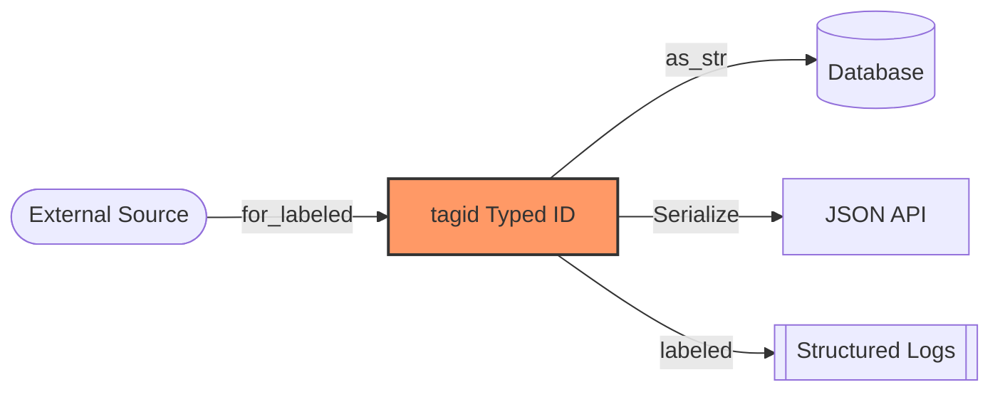

# `tagid` - Typed Unique Identifiers for Rust Entities

[](https://crates.io/crates/tagid)
[](https://docs.rs/tagid)
[](LICENSE)

`tagid` provides a robust system for defining and managing typed unique identifiers in Rust. It supports multiple ID generation strategies (CUID, UUID, Snowflake) and enables rich semantic tracking via **Provenance**.

## Core Architecture

The tagid system is built on the principle of **Zero-Cost Semantic Tagging**. It separates the identity of an object from its origin and its presentation.

### Component Overview



## Features

- **Typed Identifiers**: Define entity-specific IDs with compile-time safety.
- **Provenance Tracking**: Tag IDs with their origin (External, Generated, Imported, etc.).
- **Opaque External IDs**: Preserve prefixes (like Stripe's `cus_`) exactly as received.
- **Explicit Labeling**: Opt-in human-readable formatting for logs and UIs.
- **Multiple ID Generators**: CUID, UUID (v4/v7), Snowflake, ULID.
- **Framework Integration**: Seamless support for `serde` and `sqlx`.

## The 6 Axes of tagid Design

1.  **Provenance**: Encode the origin of an ID (8 core types) at the type level with zero runtime cost.
2.  **Strict Opaqueness**: Treat external identifiers as atomic atoms—no stripping or parsing of prefixes.
3.  **Presentation vs. Data**: `Display` and `Serialize` are strictly canonical; human-friendly context is opt-in via `.labeled()`.
4.  **Behavior Control**: Type safety ensures only `Generated` IDs can be created via `.next_id()`.
5.  **LabelPolicy Bridge**: Sensible defaults for human output based on the ID's origin.
6.  **Metadata Separation**: Auxiliary data lives in `Descriptor` types outside the core identifier.

## Usage

### Internal Generation

```rust
use tagid::{Entity, Id, Label, Sourced, LabelMode};
use tagid::id::provenance::{Generated, strategies};

#[derive(Label)]
struct User;

impl Entity for User {
    type IdGen = tagid::UuidGenerator;
}

type UserId = Id<Sourced<User, Generated<strategies::UuidV7>>, ::uuid::Uuid>;

fn main() {
    let user_id = UserId::new();
    println!("Canonical: {}", user_id);           // 018d6f...
    println!("Human:     {}", user_id.labeled());  // User::018d6f...
}
```

### External Opaque IDs

```rust
use tagid::{Id, Label, Sourced};
use tagid::id::provenance::{External, providers};

#[derive(Label)]
struct Customer;

type CustomerId = Id<Sourced<Customer, External<providers::Stripe>>, String>;

fn main() {
    // Preserve prefix "cus_" exactly as received from Stripe
    let id = CustomerId::for_labeled("cus_L3H8Z6".to_string());
    
    assert_eq!(id.to_string(), "cus_L3H8Z6");
    println!("Logging: {}", id.labeled()); // Customer@external::cus_L3H8Z6
}
```

## Data Flow (Canonical Integrity)



## Installation

Add `tagid` to your `Cargo.toml`:

```toml
[dependencies]
tagid = { version = "0.4", features = ["uuid", "serde", "sqlx"] }
```

## Examples

Detailed patterns in the `examples/` directory:
- `01_basic_generation.rs`: Internal ID creation.
- `02_external_opaque_ids.rs`: Handling foreign system identifiers.
- `03_labeling_modes.rs`: Using Policies and Overrides.
- `04_advanced_scenarios.rs`: Technical deep dive into the 6 Axes of tagid Design.
- `05_distributed_strategies.rs`: Swapping CUID, Snowflake, and ULID.

## Design Documents

For a deep dive into the architecture and principles:
- [tagid Redesign Specification](ref/tagid-redesign.md) (Technical Deep Dive)

## Contributing
Contributions are welcome! Open an issue or submit a pull request on GitHub.

## License
This project is licensed under the MIT License.
