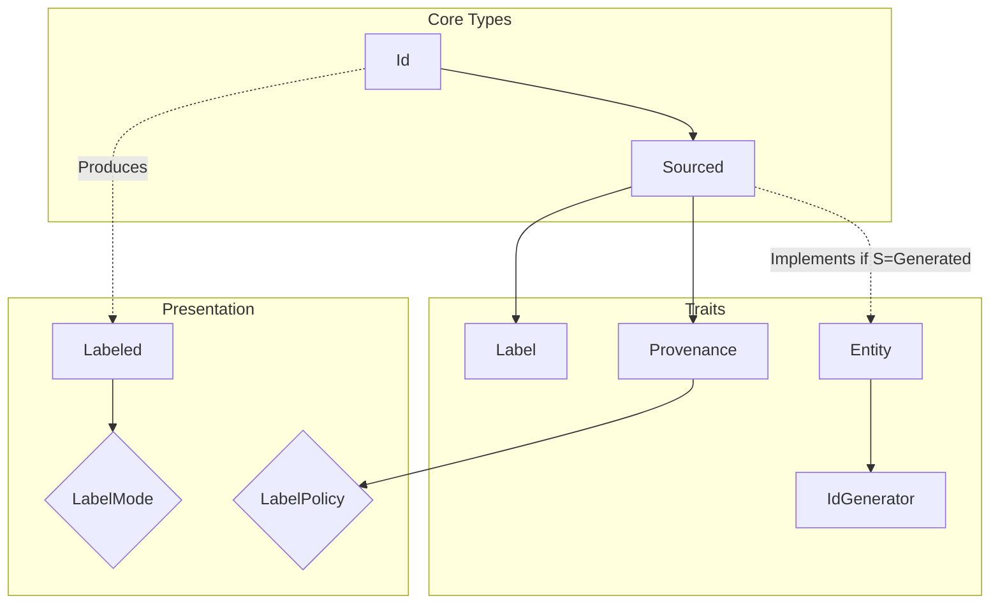
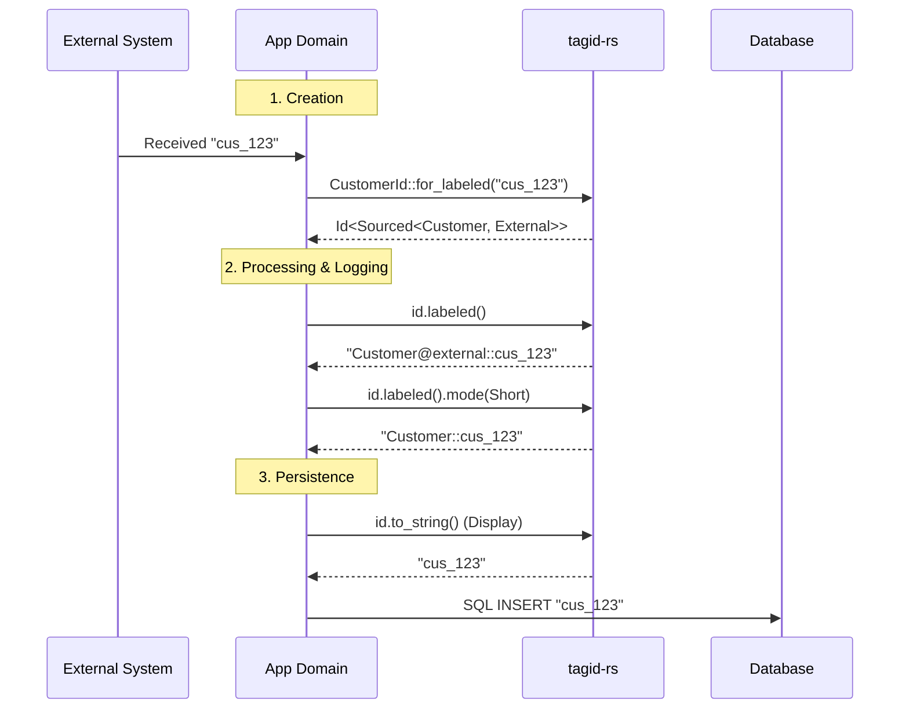
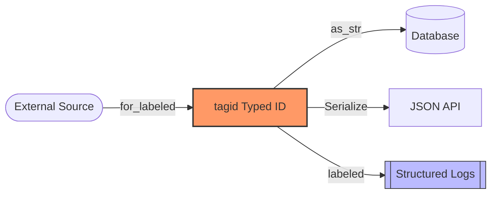

# tagid Redesign Specification: Provenance & Sourced Semantics

This document outlines the architecture and design of the `tagid-rs` redesign, providing motivation, usage patterns, and a technical deep dive into the underlying principles.

## 1. Motivation: Why Typed Identifiers?

In many systems, identifiers (IDs) are treated as plain strings or integers. This approach, while simple, introduces several risks and challenges:

1.  **Type Confusion**: Accidentally passing a `UserId` where a `CustomerId` is expected.
2.  **Loss of Context**: A log entry showing `Processing ID: 123` is useless without knowing if `123` is a User, a Job, or an Invoice.
3.  **Origin Ambiguity**: In distributed systems, it's often unclear if an ID was generated internally or provided by an external system (e.g., Stripe, GitHub).
4.  **Impedance Mismatch**: External IDs often have prefixes (like `cus_` or `app-`). Parsing or stripping these in application code creates fragile logic and synchronization bugs.

`tagid` solves these problems by providing **Zero-Cost Semantic Tagging**.

---

## 2. Simple Application

Using `tagid` is designed to be lightweight and accessible.

### 2.1 Basic Typed ID
By wrapping a raw value in an `Id<T, ID>`, you gain compile-time type safety.

```rust
use tagid::{Id, Label};

#[derive(Label)]
struct User;

// This ID can ONLY be used where a User ID is expected.
type UserId = Id<User, String>;

fn process_user(id: UserId) { /* ... */ }
```

### 2.2 Sourced IDs (Internal vs. External)
The redesign introduces `Sourced<E, S>` to distinguish the origin of an ID.

```rust
use tagid::{Id, Sourced};
use tagid::id::provenance::{Generated, External, providers};

// Internal Generated ID
type InternalId = Id<Sourced<User, Generated>, String>;

// External Opaque ID (e.g. from Stripe)
type StripeId = Id<Sourced<User, External<providers::Stripe>>, String>;
```

---

## 3. Architectural Overview

The system separates the identity of an object from its origin and its presentation.

### 3.1 Component Relationship (C4 Diagram)



---

## 4. The 6 Axes of tagid Design

The redesign is structured around six orthogonal axes that provide control over the entire identifier lifecycle.

### Axis 1: Semantic Origin (Provenance)
- **Taxonomy**: 8 core types (External, Generated, Imported, Derived, Scoped, Temporary, ClientProvided, AliasOf).
- **Type Parameters**: Optional parameters like `External<Stripe>` allow embedding system info at the type level with **zero runtime overhead**.

### Axis 2: Strict Opaque Handling
- **Principle**: External IDs are atomic. If Stripe gives you `"cus_L3H8Z6"`, tagid preserves the *entire* string as the canonical value. No stripping, no parsing at the boundary.

### Axis 3: Presentation vs. Data (Labeling)
- **Canonical Form**: `Display` and `Serialize` are strictly label-free (stable for DB/APIs).
- **Human Context**: Opt-in via `.labeled()`. 
- **Modes**: `None` (value), `Short` (`Entity::value`), `Full` (`Entity@provenance::value`).

### Axis 4: Behavior Control (Type Safety)
- **Generation Safety**: Only IDs marked as `Generated` implement the `Entity` trait, allowing `.next_id()`. This prevents developers from accidentally "generating" an ID that must come from an external source.

### Axis 5: LabelPolicy Bridge
- **Defaults**: Each `Provenance` type specifies a `LabelPolicy` (e.g., `ExternalKeyDefault` defaults to showing full provenance in logs, while `EntityNameDefault` shows only the entity name).

### Axis 6: Metadata Separation (Descriptors)
- **Lean IDs**: Associated metadata (like generation timestamps) lives in separate `Descriptor` types, not in the `Id` string itself.

---

## 5. ID Lifecycle (Sequence Diagram)



---

## 6. Data Flow (Canonical Integrity)



This architecture ensures that while developers get rich, type-safe, and descriptive identifiers in their code, the data leaving the application boundary remains compatible with all downstream systems.

For a concrete demonstration of these principles, see `examples/04_advanced_scenarios.rs`.
